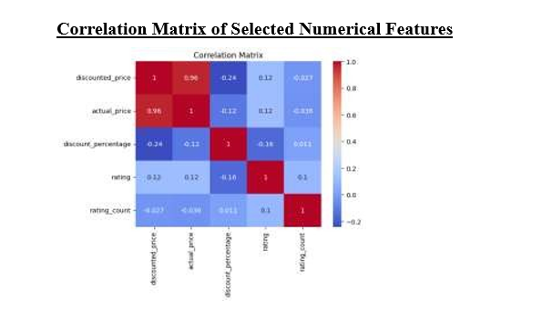
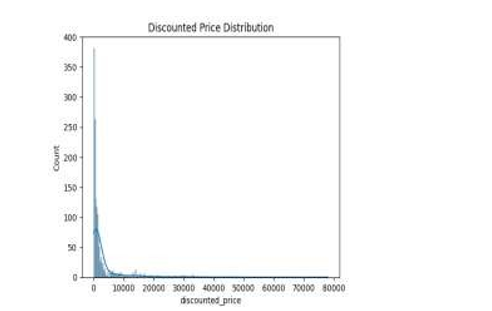
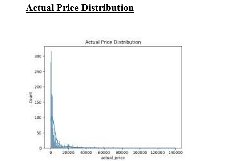

# Amazon Product Data Analysis using Python

## Project Overview

This project was developed as my BCA Final Semester Project using Python in Google Colab.

The objective of this project was to analyze Amazon product data, explore pricing patterns, understand relationships between important features, and build a Linear Regression model to predict discounted product prices.

Python libraries were used for data cleaning, visualization, exploratory data analysis (EDA), and machine learning.

---

## Tools & Technologies

- Python
- Google Colab
- Pandas
- NumPy
- Matplotlib
- Seaborn
- Scikit-learn
- Linear Regression

---

## Project Workflow

1. Imported the Amazon product dataset.
2. Cleaned and preprocessed the data.
3. Performed Exploratory Data Analysis (EDA).
4. Visualized price distributions.
5. Generated a Correlation Matrix.
6. Selected important features.
7. Trained a Linear Regression model.
8. Evaluated model performance.
9. Compared actual and predicted values.
10. Generated business insights.

---

## Features

- Data Cleaning
- Exploratory Data Analysis (EDA)
- Correlation Analysis
- Data Visualization
- Machine Learning
- Linear Regression Model

---

## Project Preview

### 1. Correlation Matrix

Shows relationships between Actual Price, Discounted Price, Rating, Rating Count, and Discount Percentage.

---

### 2. Discounted Price Distribution

Visualizes the distribution of discounted product prices across the dataset.

---

### 3. Actual Price Distribution

Displays the distribution of original product prices and highlights pricing patterns.

---

## Key Insights

- Actual Price has the strongest influence on Discounted Price.
- Most products belong to the lower price range.
- Product ratings show a weak relationship with pricing.
- Exploratory Data Analysis helped identify pricing trends and feature relationships.

---

## Author

**Saloni Gupta**

MCA (Data Science) Student

Aspiring Data Analyst
